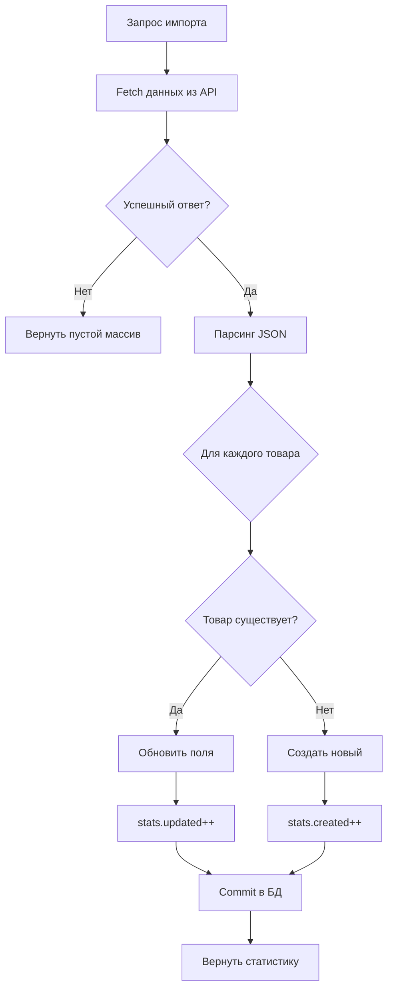

# Документация по интеграции с внешними API

## Оглавление

1. [Общие принципы](#общие-принципы)
2. [Архитектура импорта](#архитектура-импорта)
3. [Диагностика проблем](#диагностика-проблем)
4. [Опыт интеграции с FoodPlanner](#опыт-интеграции-с-foodplanner)
5. [Best Practices](#best-practices)

---

## Общие принципы

### Структура сервиса импорта

Импорт из внешних API организован в виде отдельного сервиса [`import_service.py`](file:///c:/wndr/repo/supermarket_catalog/backend/import_service.py) со следующими компонентами:

```python
# 1. Константа с URL внешнего API
EXTERNAL_API_URL = "http://example.com/api/products/"

# 2. Функция запроса данных
def fetch_external_products():
    # Логика получения данных
    pass

# 3. Асинхронная функция импорта
async def import_products_from_service(session: AsyncSession) -> dict:
    # Логика сохранения в БД
    pass
```

### Эндпоинт для запуска импорта

Импорт запускается через POST-запрос к эндпоинту `/admin/import`:

```python
@router.post("/import")
async def import_products_endpoint(session: AsyncSession = Depends(get_session)):
    from import_service import import_products_from_service
    stats = await import_products_from_service(session)
    return {
        "message": f"Создано: {stats['created']}, Обновлено: {stats['updated']}",
        "created": stats["created"],
        "updated": stats["updated"]
    }
```

---

## Архитектура импорта

### Алгоритм работы



### Маппинг данных

Данные из внешнего API маппятся на модель `Product`:

| Внешнее поле | Внутреннее поле | Преобразование |
|--------------|-----------------|----------------|
| `name` | `name` | Без изменений |
| `price` | `price` | Без изменений |
| `unit: "kg"` | `weight` | `amount * 1000` (кг → г) |
| `unit: "l"` | `weight` | `amount * 1000` (л → мл) |
| `unit: "pcs"` | `quantity` | `int(amount)` |
| `weight_per_piece` | `weight_per_piece` | Без изменений |
| `calories` | `calories` | Без изменений |
| `proteins` | `proteins` | Без изменений |
| `fats` | `fats` | Без изменений |
| `carbs` | `carbs` | Без изменений |

#### Специальная логика для штучных товаров

Для товаров с `unit: "pcs"` и указанным `weight_per_piece`:

```python
if unit == 'pcs' and weight_per_piece:
    quantity = int(amount)
    # Конвертируем из кг в граммы
    weight = quantity * (weight_per_piece * 1000)
```

**Пример:**
```json
{
  "name": "Banana",
  "unit": "pcs",
  "amount": 5,
  "weight_per_piece": 0.12
}
```
Результат: `quantity = 5`, `weight = 600` (граммов)

---

## Диагностика проблем

### Типичные проблемы и решения

#### 1. **Ошибка: "Expecting value: line 1 column 1 (char 0)"**

**Причина:** Сервер возвращает не JSON (HTML, пустой ответ)

**Диагностика:**
```python
response = requests.get(url)
print(f"Content-Type: {response.headers.get('content-type')}")
print(f"Response: {response.text[:200]}")
```

**Решение:** Проверьте правильность URL и что обращаетесь к backend API, а не frontend

#### 2. **Ошибка: 404 Not Found**

**Причина:** Неправильный путь к эндпоинту

**Диагностика:** Используйте автоматический перебор вариантов:
```python
possible_urls = [
    f"{base_url}/products/",
    f"{base_url}/products",
    f"{base_url}/api/products/",
    f"{base_url}/api/products",
]
```

**Решение:** Проверьте документацию API или откройте `/docs` (Swagger)

#### 3. **Неправильный порт**

**Признаки:**
- Порт 8010 возвращает HTML фронтенда
- Content-Type: `text/html` вместо `application/json`

**Решение:**
- Frontend обычно на портах: 3000, 8010, 5173
- Backend API обычно на портах: 8000, 8080, 5000

### Автоматическая диагностика

Реализована в [`import_service.py`](file:///c:/wndr/repo/supermarket_catalog/backend/import_service.py):

```python
def fetch_external_products():
    base_url = "http://192.168.10.222:8000"
    
    # 1. Проверка корневого пути
    response = requests.get(base_url)
    print(f"Root path: {response.status_code}")
    
    # 2. Проверка Swagger документации
    response = requests.get(f"{base_url}/docs")
    print(f"/docs endpoint: {response.status_code}")
    
    # 3. Перебор возможных путей
    for url in possible_urls:
        response = requests.get(url)
        if response.status_code == 200:
            return response.json()
    
    return []
```

---

## Опыт интеграции с FoodPlanner

### История интеграции

> [!IMPORTANT]
> При интеграции с FoodPlanner API были обнаружены несоответствия между документацией и фактическим развертыванием.

### Проблемы и решения

#### Проблема 1: Неправильный порт в документации

**Документация указывала:**
```
http://192.168.10.222:8010/products/
```

**Фактически:**
- Порт `8010` - **Frontend** (React/Vue приложение)
- Порт `8000` - **Backend API** (FastAPI)

**Решение:**
```python
EXTERNAL_API_URL = "http://192.168.10.222:8000/products/"
```

#### Проблема 2: Эндпоинт не найден (404)

**Симптомы:**
```
Response status code: 404
{"detail":"Not Found"}
```

**Возможные причины:**
1. ❌ API не развернут на этом сервере
2. ❌ Используется другой endpoint (например `/api/products/`)
3. ❌ Требуется авторизация
4. ❌ Версия API отличается от документации

**Проверочный чек-лист:**

- [ ] Откройте `http://192.168.10.222:8000/docs` в браузере
- [ ] Проверьте список доступных эндпоинтов в Swagger
- [ ] Убедитесь, что сервис запущен: `curl http://192.168.10.222:8000/`
- [ ] Проверьте логи сервера FoodPlanner

#### Проблема 3: Несоответствие формата ответа

**Документация обещала:**
```json
{
  "message": "...",
  "created": 5,
  "updated": 3
}
```

**Изначальная реализация возвращала:**
```json
{
  "message": "...",
  "stats": {
    "fetched": 10,
    "imported": 5,
    "skipped": 3
  }
}
```

**Решение:** Приведение к стандарту документации
```python
return {
    "message": f"Создано: {stats['created']}, Обновлено: {stats['updated']}",
    "created": stats["created"],
    "updated": stats["updated"]
}
```

### Рекомендации для FoodPlanner

> [!TIP]
> Для успешной интеграции с FoodPlanner API:

1. **Проверьте актуальность документации** - порты и эндпоинты могут отличаться
2. **Используйте Swagger UI** - `/docs` покажет реальную структуру API
3. **Добавьте логирование** - подробные логи помогут быстро найти проблему
4. **Тестируйте в браузере** - откройте API URL в браузере для быстрой проверки

### Ожидаемый формат данных FoodPlanner

Согласно [API_DOCS.md](https://github.com/sergesvalov/foodplanner/blob/main/backend/API_DOCS.md):

```json
[
  {
    "name": "Apple",
    "price": 1.5,
    "unit": "kg",
    "amount": 1,
    "calories": 52,
    "proteins": 0.3,
    "fats": 0.2,
    "carbs": 14,
    "weight_per_piece": 0.15,
    "id": 1
  }
]
```

---

## Best Practices

### 1. Обработка ошибок

```python
def fetch_external_products():
    try:
        response = requests.get(url, timeout=10)
        response.raise_for_status()
        
        try:
            return response.json()
        except ValueError as json_err:
            print(f"JSON parsing error: {json_err}")
            print(f"Response text: {response.text}")
            return []
            
    except requests.RequestException as e:
        print(f"Request error: {e}")
        return []
```

### 2. Логирование

> [!NOTE]
> Добавляйте подробное логирование для диагностики:

```python
print(f"Fetching from: {url}")
print(f"Status code: {response.status_code}")
print(f"Content-Type: {response.headers.get('content-type')}")
print(f"Response length: {len(response.content)} bytes")
```

### 3. Таймауты

Всегда указывайте таймаут для внешних запросов:

```python
response = requests.get(url, timeout=10)  # 10 секунд
```

### 4. Идемпотентность

Импорт должен быть идемпотентным - повторный запуск не должен дублировать данные:

```python
# Проверка существования
existing_product = session.execute(
    select(Product).where(Product.name == ext_prod['name'])
).scalars().first()

if existing_product:
    # Обновляем
    existing_product.price = ext_prod['price']
else:
    # Создаем новый
    session.add(Product(...))
```

### 5. Транзакции

Используйте транзакции для атомарности:

```python
async def import_products_from_service(session: AsyncSession):
    try:
        # Все операции с БД
        for product in products:
            session.add(product)
        
        # Единый commit в конце
        await session.commit()
    except Exception as e:
        await session.rollback()
        raise
```

### 6. Валидация данных

Проверяйте обязательные поля перед импортом:

```python
required_fields = ['name', 'price', 'unit']
if not all(field in ext_prod for field in required_fields):
    print(f"Skipping invalid product: {ext_prod}")
    continue
```

---

## Тестирование

### Unit-тесты

Пример теста импорта из [`test_import_mock.py`](file:///c:/wndr/repo/supermarket_catalog/tests/test_import_mock.py):

```python
@pytest.mark.asyncio
async def test_import_products_update_existing():
    """Test that existing products are updated, not skipped"""
    with patch('backend.import_service.requests.get') as mock_get:
        mock_response = MagicMock()
        mock_response.json.return_value = MOCK_API_RESPONSE
        mock_get.return_value = mock_response

        # Mock existing product
        existing_apple = MagicMock()
        existing_apple.price = 1.0  # Old price
        
        stats = await import_products_from_service(mock_session)

        # Verify update
        assert stats["updated"] == 1
        assert existing_apple.price == 1.5  # New price
```

### Ручное тестирование

```bash
# Проверка доступности API
curl http://192.168.10.222:8000/products/

# Запуск импорта
curl -X POST http://localhost:8000/admin/import
```

---

## Конфигурация

### Переменные окружения

Рекомендуется вынести URL в переменные окружения:

```python
import os

EXTERNAL_API_URL = os.getenv(
    "EXTERNAL_API_URL", 
    "http://192.168.10.222:8000/products/"
)
```

`.env` файл:
```bash
EXTERNAL_API_URL=http://192.168.10.222:8000/products/
EXTERNAL_API_TIMEOUT=10
```

---

## Troubleshooting

### Чеклист диагностики проблем

1. **Проверьте доступность сервера:**
   ```bash
   ping 192.168.10.222
   ```

2. **Проверьте доступность порта:**
   ```bash
   curl http://192.168.10.222:8000/
   ```

3. **Откройте Swagger документацию:**
   ```
   http://192.168.10.222:8000/docs
   ```

4. **Проверьте логи backend сервиса:**
   ```bash
   docker logs <container_name>
   ```

5. **Проверьте формат ответа в браузере:**
   - Откройте `http://192.168.10.222:8000/products/`
   - Убедитесь, что возвращается JSON

### Частые ошибки

| Ошибка | Причина | Решение |
|--------|---------|---------|
| Connection timeout | Сервер недоступен | Проверьте сеть, firewall |
| 404 Not Found | Неправильный endpoint | Проверьте `/docs` |
| JSON decode error | HTML вместо JSON | Проверьте порт (backend vs frontend) |
| 401 Unauthorized | Требуется авторизация | Добавьте токен в headers |
| SSL Error | Проблема с сертификатом | Используйте `verify=False` (только для dev) |

---

## Примеры интеграции

### Интеграция с авторизацией

```python
def fetch_external_products():
    headers = {
        "Authorization": f"Bearer {API_TOKEN}",
        "Content-Type": "application/json"
    }
    response = requests.get(EXTERNAL_API_URL, headers=headers, timeout=10)
    return response.json()
```

### Интеграция с пагинацией

```python
def fetch_all_products():
    all_products = []
    page = 1
    
    while True:
        response = requests.get(
            EXTERNAL_API_URL,
            params={"page": page, "limit": 100}
        )
        data = response.json()
        
        if not data.get("items"):
            break
            
        all_products.extend(data["items"])
        page += 1
    
    return all_products
```

### Интеграция с rate limiting

```python
import time

def fetch_with_rate_limit():
    products = []
    for batch in batches:
        response = requests.get(f"{API_URL}?ids={batch}")
        products.extend(response.json())
        time.sleep(1)  # 1 запрос в секунду
    return products
```

---

## Заключение

Интеграция с внешними API требует:
- ✅ Тщательной диагностики endpoint'ов
- ✅ Подробного логирования
- ✅ Обработки ошибок
- ✅ Идемпотентности операций
- ✅ Тестирования на mock-данных

При работе с FoodPlanner API особое внимание следует уделить **проверке портов** и **актуальности документации**.
